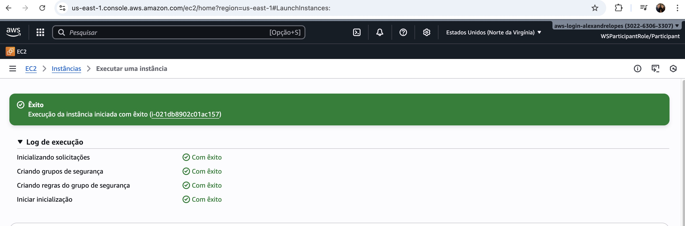
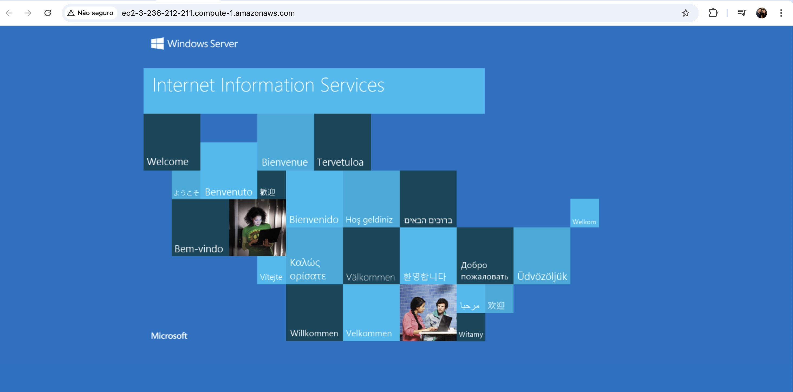
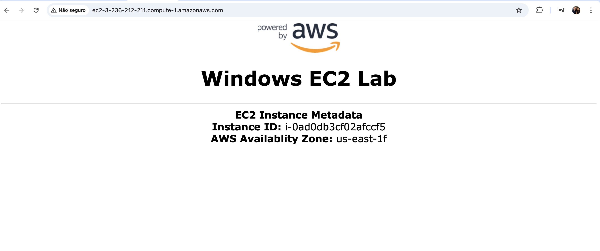
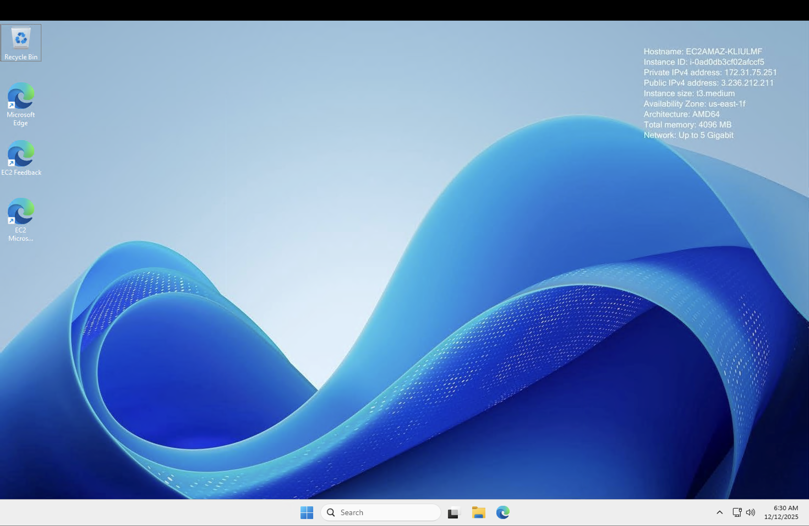

## Launch a Web Server Instance

In this Lab I have launch a Windows Server 2025 instance with Internet Information Services (IIS) and a Web Page setup.\
After that I have Connect in the public DNS and also with RDP Connection using a Macbook.

## Launch a Web Server Instance

## Public Browser The Web Server

## AWS

## RDP Connection (as admin/on virtual machine)

