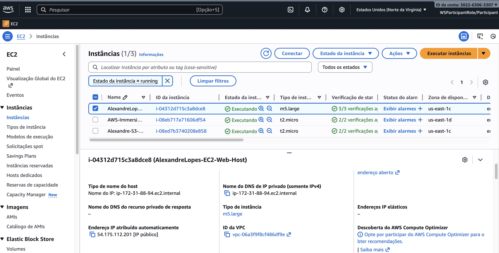
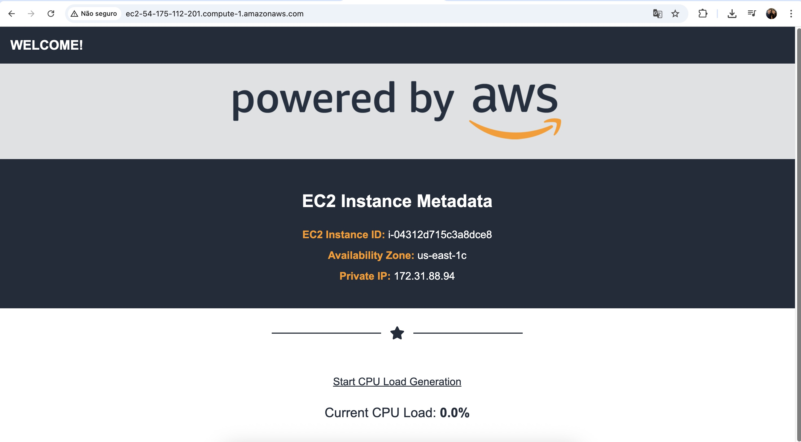

Amazon EC2 Auto Scaling Hands-On Lab

This lab was designed to give some experiences with console. 
In this especific one, interacting with the EC2 Auto Scalings service through the AWS Console and demonstrate 
the EC2 Auto Scaling during peak loads using a customer's custom AMI. 

This repository demonstrate the conclusion of the following steps:

Create your own web server by going through the labs in the order below:

**Primary:** Auto Scaling, Launch Templates, Creation and configuration of Security Groups
**Secondary:** AMIs, Application Load Balancers

## AWS Console:

## Final Result

