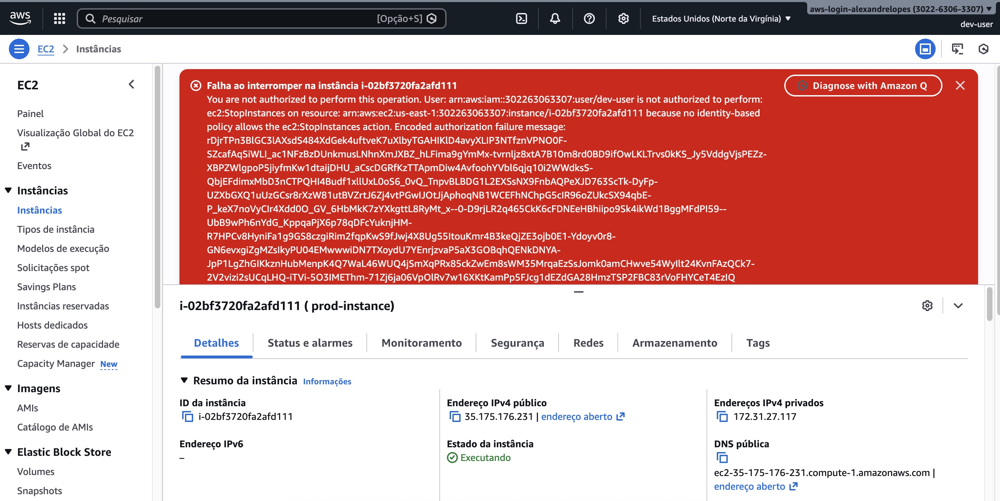

## Amazon IAM Hands-On Lab

This hands on lab is broken into the following parts:

• Launch EC2 Instances with Tags\
• Create AWS IAM Identities\
• Test the access for resources\
• Assign IAM Role for EC2 Instance and Test the access

## IAM User created:

## Acess Denied to Stop the Instance without permition 

The Test is 100% completed.  
