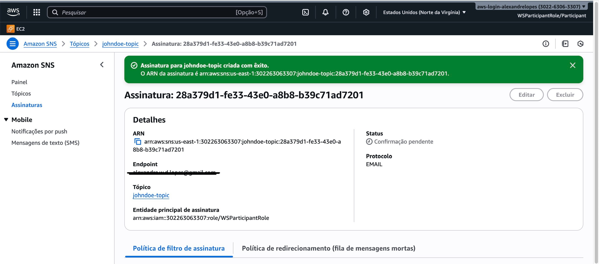
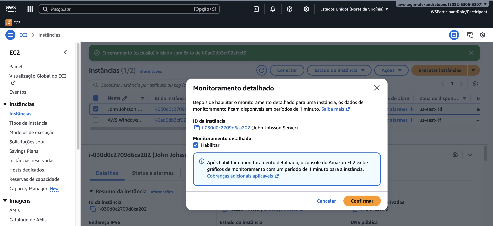
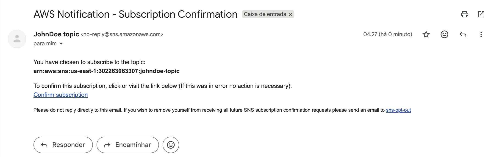

## Amazon SNS notifications Hands-On Lab

This hands on lab is broken into the following parts:

• Create a topic\
• Create an assignature to SNS\
• Create the EC2 Instance\
• Create the Alarm\
• Assign IAM Role for EC2 Instance and Test the access

## Topic created and assigned

## Detailed Monitoring

## AWS Email Notification Connected w/ the same email endpoint in the Assignature

