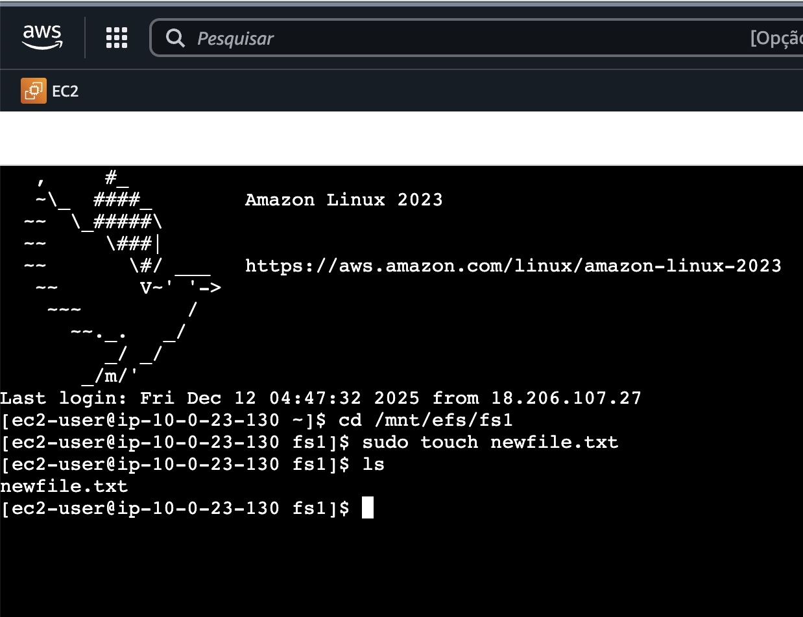

## Amazon Elastic File System (EFS) Hands-On Lab

This lab was designed to give some experiences with console. 
In this especific one, interacting with the EC2 instances, also creating VPC's to work together with the EFS 

This repository demonstrate the conclusion of the following steps:

• Create a Virtual Private Cloud (VPC) with two Public Subnets\
• Create Security Groups for EC2 and EFS\
• Create an Elastic File system (EFS)\
• Create the first EC2 Instance and Mount our EFS drive\
• Create the second EC2 Instance and Mount our EFS drive\
• Connect to both EC2 instances using Instance Connect\
• Create a file on EFS drive\
• Demonstrate the EFS mount from the second instance\
• Clean up

## Creating the EFS:

## EFS-1 and EF-2 running already with the Security Groups parameters 

## EFS-1 running connected

## EFS-2 running connected

##  Create a file on EFS drive

