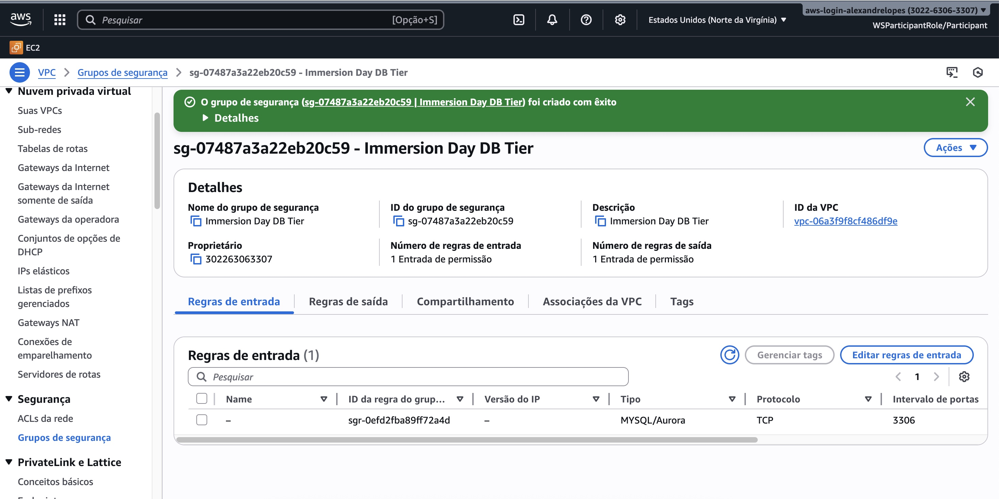
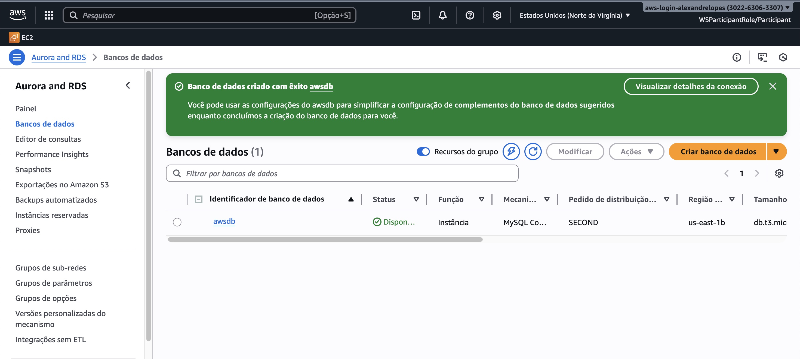
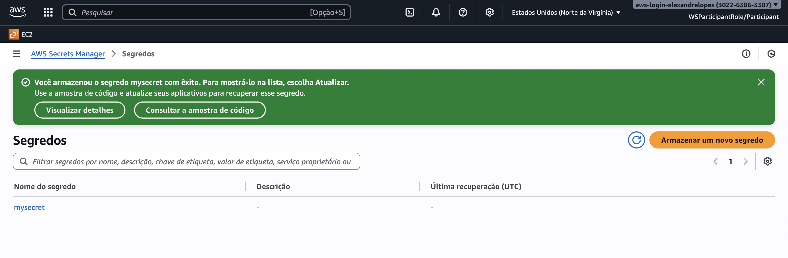

## Amazon RDS MySQL Hands On Lab

• Create VPC Security Group\
• Launch an RDS Instance\
• Save RDS Credentials\
• Clean Up Resources

## Create VPC Security Group

## Launch an RDS Instance

## Save RDS Credentials into Secrets Manager

